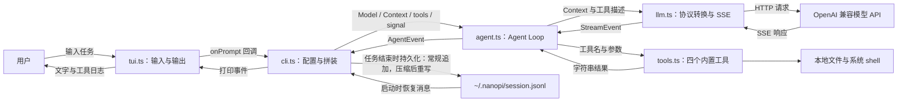
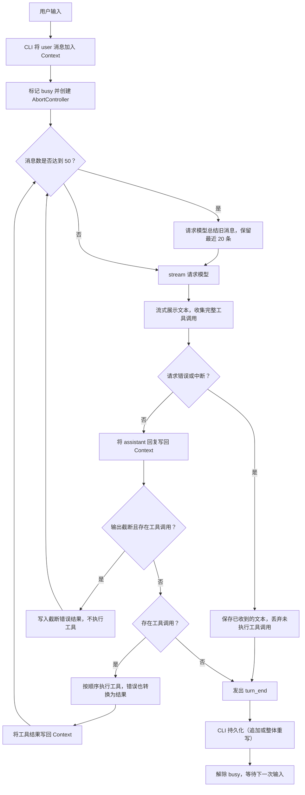
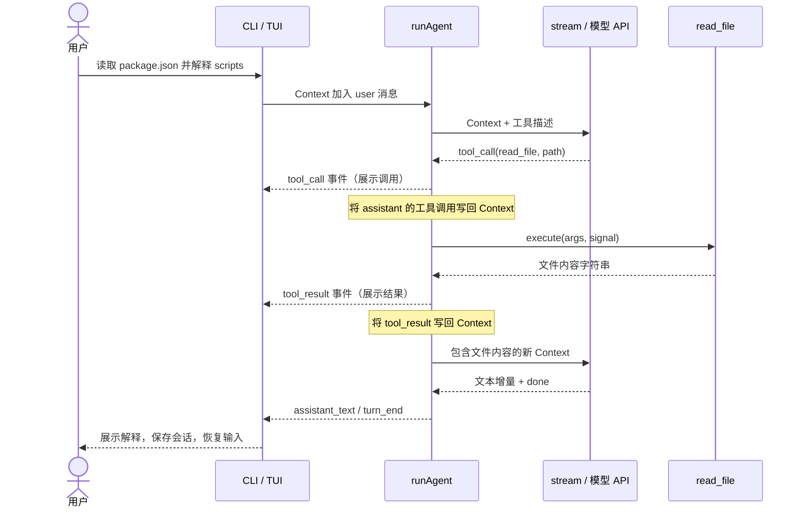
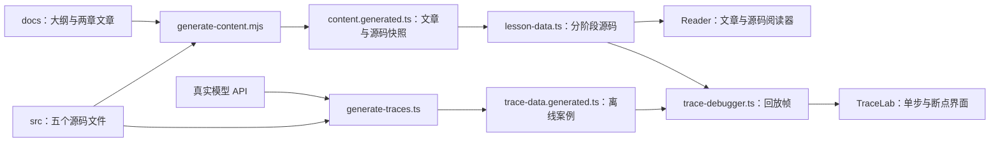

# 项目逻辑图

本项目沿着一条核心数据流组织：**用户输入 → Context → 模型 → 工具执行 → 结果写回 Context → 再问模型**。

下图使用 Mermaid，GitHub 可以直接渲染。若本地 Markdown 编辑器只显示代码块，也可以阅读图后的说明。

## 1. 五个模块如何协作



| 文件 | 主要入口 | 职责 |
| --- | --- | --- |
| `src/cli.ts` | `main()` | 读取配置、恢复会话、连接输入/Agent/输出、保存会话 |
| `src/agent.ts` | `runAgent()` | 维护循环、执行工具、更新 Context、发出界面事件 |
| `src/llm.ts` | `stream()` | 转换消息格式、发出请求、解析流式文本和工具调用 |
| `src/tools.ts` | `builtinTools()` | 提供 `read_file`、`write_file`、`edit`、`run_bash` |
| `src/tui.ts` | `Tui` | 接收单行输入、打印输出、通知 CLI 中断当前任务 |

工具不修改 Context；消息更新由 Agent 完成。TUI 不直接消费 AgentEvent 对象，CLI 的 `switch` 将事件分发给它的打印方法。传给模型的是工具描述与 JSON Schema，`execute` 函数始终在本地运行。

## 2. 一个用户任务的执行流程



- 一次用户任务可能包含多次模型请求。执行工具之后通常会再次请求模型，让它根据工具结果继续工作。
- compaction 使用同一个 `stream()` 收集摘要；摘要请求失败或被中断时保留原上下文。切点会对齐轮次边界：`tool_result` 与它的 `tool_use` 留在同一侧，避免压缩后出现孤儿 `tool_result` 导致下一次请求 API 400。
- 会话持久化通常只追加新增消息；compaction 替换并缩短 `context.messages` 后，`persistSession()` 会检测到已持久化消息不再位于原下标，改为整体重写 JSONL，使文件与当前 Context 对齐。
- 消息阈值以条数近似，不是精确的 token 预算；循环没有硬编码的最大步数。
- 工具执行被中断时，为未执行的调用补上 `error: aborted`，保持调用和结果成对；后续模型请求会接收到已中断的信号。
- 每轮有工具调用的 assistant 消息必须与相同 ID 的 tool_result 对应，模型 API 才能继续处理对话。

## 3. 以读取文件为例



两层事件的区别：

| 层 | 事件 | 含义 |
| --- | --- | --- |
| LLM → Agent | `text_delta` / `tool_call` / `done` / `error` | 一次模型请求的输出 |
| Agent → CLI | `assistant_text` / `tool_call` / `tool_result` / `turn_end` | 整个任务执行期间供界面展示的进度 |

Context 内部将工具调用放入 assistant 消息的 `tool_use` 内容块，将工具结果放入 user 消息的 `tool_result` 内容块。`contextToOpenAIMessages()` 再将它们转换为 OpenAI 的 `tool_calls` 与独立的 `role: tool` 消息。

## 4. 教学网站的数据流程



网站开发和构建前会执行内容生成脚本。它读取 `docs/pi-from-scratch.md`、`docs/ch01-modules.md`、`docs/ch02-loop.md` 与五个源码文件。其中大纲文件 `docs/pi-from-scratch.md` 被根目录 `.gitignore` 忽略，普通克隆通常会走回退分支：文章正文沿用已提交的快照，而**源码快照始终从 `src/` 重新生成**，所以修改 `src/` 后网站内容会跟上。两份章节文档被 Git 跟踪、每次构建都会直接读取，改动会正常出现在网站；只有大纲文件本身的改动需要先恢复该文件。

Trace 生成是单独的维护步骤：脚本在临时目录运行真实 Agent、记录事件和 Context，再输出离线案例。浏览器使用这些记录进行回放，不连接模型 API。`generate-traces.ts` 用**内容匹配**（`findLine`）定位源码行号，不写死行号，因此加注释不会让重新生成失败。回放界面展示的每一步行号也是运行时按**当前源码内容**重新解析的（`trace-debugger.ts` 的 `source()`），已提交 trace 数据里记录的行号偏移不影响高亮；但 `trace-debugger.ts` 自身有两处硬编码锚点需要手动同步，见下文"行号即契约"。另外 `TRACE_CASE=案例id` 可以只重跑单个案例，其余案例会沿用生成文件中已有的数据，不会被覆盖。

### 改动源码前必读：行号即契约

`lesson-data.ts` 的教学片段按**硬编码行号**截取源码（`selectLines(llm, [[1, 50], ...])`）。改动 `src/` 的行数后，这些区间会整体偏移，教学网站会展示错误的代码，甚至直接构建失败——`assertProgressiveCheckpoints` 会抛出 `Checkpoint xxx rewrites existing code`。

正确做法是按内容对齐后整体平移区间。改动后在项目根目录运行：

```bash
npm run check:slices
```

它会检查两件事：`content.generated.ts` 是否与 `src/` 同步，以及 `lesson-data.ts` 自带的递进断言是否通过。两个切片变量的结束行相差 1 行是**刻意设计**（靠 `selectLines` 末尾的 `trimEnd()` 消除空行差异），修改时要保留这个错位关系。

另外，`lesson-data.ts` 会把行尾统一为 `\n`。源码在 Windows 上检出为 CRLF，若不归一化，切片与完整文件在边界处的空白不一致，同样会触发上述断言失败。

`web/app/trace-debugger.ts` 有同一性质的契约，且没有自动检查：`functionName()` 用硬编码行号阈值划分各函数的区间（决定回放调用栈显示的函数名），两处 `return` 步骤按**出现次序**锚定到 `agent.ts` 的具体行。改动 `src/` 行数或增删 `return` 后需要手动同步这两处，否则回放不报错，但调用栈和高亮会指向错误的位置。

## 5. 目录导航

```text
pi-from-scratch/
├── src/                     nano-pi 的五个核心模块
├── test/                    单元测试与独立的真实 API 测试脚本
├── docs/                    文章、新手指南、项目逻辑图
├── scripts/generate-traces.ts 生成真实模型的离线案例
├── scripts/check-teaching-slices.mjs 教学切片对齐检查（改 src/ 后运行）
├── web/                     独立安装依赖的 Next.js 教学网站
│   ├── app/                 阅读器、Trace 界面和生成数据
│   ├── scripts/             教学内容生成脚本
│   └── tests/               网站配置与构建结果测试
├── .env.example             CLI 配置模板
└── package.json             核心项目的运行、编译和测试命令
```

接下来阅读[新手入门指南](getting-started.md)，或返回[项目首页](../README.md)。
